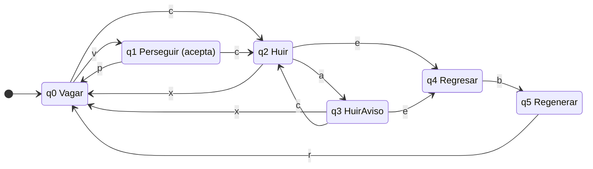

# Ejercicio 5. Del artículo al autómata

Práctica 2: Autómatas Finitos No Deterministas (AFND) y Simulación de AFD con Interfaz Gráfica
Teoría de la Computación, ESCOM-IPN

[Volver al índice](../README.md)

## Índice

- [5.1 Aplicación elegida](#51-aplicación-elegida)
- [5.2 Entregables](#52-entregables)
  - [Alfabeto de eventos](#alfabeto-de-eventos)
  - [Definición formal](#definición-formal)
  - [Tabla de transiciones y diagrama](#tabla-de-transiciones-y-diagrama)
  - [Archivo .jff](#archivo-jff)
  - [Cadenas de prueba](#cadenas-de-prueba)
  - [Abstracción](#abstracción)
- [5.3 Propuesta de trabajo (opcional)](#53-propuesta-de-trabajo-opcional)
- [Referencias](#referencias)

---

## 5.1 Aplicación elegida

Se modela el **comportamiento de los fantasmas de Pac-Man**, descrito en la figura 3 de Gribkoff (2013), una de las opciones que propone el enunciado. En ese texto cada fantasma pasa por cuatro comportamientos: vagar, perseguir a Pac-Man, huir y volver a la base central para regenerarse. Gribkoff (2013) los presenta como un diagrama de estados con eventos como «ver a Pac-Man», «perderlo», «Pac-Man come una píldora de poder», «la píldora expira», «ser comido» y «alcanzar la base».

**Estatus de la fuente.** Gribkoff (2013) es material de curso, no un libro ni un artículo arbitrado, de modo que aquí se usa únicamente como *el objeto que se modela*, tal como lo indica el enunciado. Las afirmaciones teóricas se sustentan en Sipser (2013) y en Rabin y Scott (1959). Sobre el juego real no se afirma nada que no esté en ese texto.

**Interpretación a verificar.** El texto describe explícitamente la transición de Perseguir a Huir cuando Pac-Man come una píldora. La figura repite esa etiqueta, y aquí se interpreta que también existe de Vagar a Huir, lo cual es coherente con la descripción. Compare esta lectura con la figura 3 original antes de entregar.

### Ampliación: dos estados y dos eventos nuevos

| Elemento nuevo | Justificación |
|---|---|
| Estado **Regenerar** (q₅) y evento **regeneración completa** (r) | El texto indica que el fantasma vuelve a la base *para regenerarse*, pero el modelo de cuatro estados pasa de Regresar a Vagar en el mismo instante de llegar. Separar «llegar a la base» de «terminar de regenerarse» modela que la regeneración tarda. |
| Estado **HuirAviso** (q₃) y evento **aviso de expiración** (a) | Decisión de diseño propia, no tomada del texto. Distingue el tramo final de la huida, en que la píldora está por agotarse, del tramo inicial, y es necesario para modelar que una segunda píldora reinicia la huida completa (HuirAviso → Huir con c). |

## 5.2 Entregables

### Alfabeto de eventos

Σ = {v, p, c, x, a, e, b, r}. Cada símbolo es un *evento del juego*, no un carácter: una cadena es una historia de eventos.

| Símbolo | Evento | Origen |
|---|---|---|
| v | El fantasma **ve** a Pac-Man | Gribkoff (2013) |
| p | El fantasma **pierde** a Pac-Man | Gribkoff (2013) |
| c | Pac-Man **come** una píldora de poder | Gribkoff (2013) |
| x | La píldora **expira** | Gribkoff (2013) |
| e | El fantasma es **comido** por Pac-Man | Gribkoff (2013) |
| b | El fantasma alcanza la **base** central | Gribkoff (2013) |
| a | **Aviso**: la píldora está por expirar | Nuevo |
| r | **Regeneración** completa | Nuevo |

### Definición formal

Es un AFD completo M = (Q, Σ, δ, q₀, F), con:

- Q = {q₀, q₁, q₂, q₃, q₄, q₅};
- Σ como se definió arriba;
- estado inicial q₀ (Vagar);
- F = {q₁} (Perseguir);
- δ : Q × Σ → Q según la tabla de transiciones.

**Qué representa cada estado** (información del prefijo leído, es decir, de la historia de eventos):

| Estado | Nombre | Información que resume del prefijo |
|---|---|---|
| q₀ | Vagar | No hay persecución ni huida en curso: nada ocurrió, o la última fase terminó (perdió a Pac-Man, expiró la píldora o terminó de regenerarse). |
| q₁ | Perseguir | La última novedad relevante fue ver a Pac-Man y no hay píldora activa. **Es el único estado de aceptación.** |
| q₂ | Huir | Hay una píldora activa y todavía no se ha avisado de su expiración. |
| q₃ | HuirAviso | Hay una píldora activa en su tramo final. |
| q₄ | Regresar | El fantasma fue comido y aún no llega a la base. |
| q₅ | Regenerar | El fantasma está en la base, regenerándose. |

**Por qué F = {q₁}.** Un fantasma no *reconoce* un lenguaje: tiene comportamientos. Para poder usar las nociones de «cadena aceptada» y de simulador, se fija una pregunta de sí o no: *¿la historia de eventos deja al fantasma persiguiendo a Pac-Man?* Es una convención de modelado; Gribkoff (2013), en el caso de la máquina expendedora, declara F = ∅ y usa el diagrama solo como modelo de estados.

**Convención sobre eventos que no aplican.** En un estado donde el evento no tiene efecto (por ejemplo, ver a Pac-Man mientras se regenera) la transición es un **bucle**. Gribkoff (2013) usa la misma convención en su ejemplo de la expendedora. Así el AFD es *completo*, y no hay que distinguir «rechazada por no ser el estado final» de «rechazada por evento inválido».

### Tabla de transiciones y diagrama

| Estado | v | p | c | x | a | e | b | r |
|---|---|---|---|---|---|---|---|---|
| → q0 | q1 | q0 | q2 | q0 | q0 | q0 | q0 | q0 |
| *q1 | q1 | q0 | q2 | q1 | q1 | q1 | q1 | q1 |
| q2 | q2 | q2 | q2 | q0 | q3 | q4 | q2 | q2 |
| q3 | q3 | q3 | q2 | q0 | q3 | q4 | q3 | q3 |
| q4 | q4 | q4 | q4 | q4 | q4 | q4 | q5 | q4 |
| q5 | q5 | q5 | q5 | q5 | q5 | q5 | q5 | q0 |

(→ estado inicial; \* estado de aceptación.)



El diagrama omite los bucles (todos los pares estado-evento que no aparecen arriba), que están en la tabla y en el .jff.

### Archivo .jff

Guárdelo como `automatas/aplicacion/pacman_fantasma.jff` (el mismo autómata se exporta también a `.json` y `.xml` desde el simulador). Las 48 transiciones son las de la tabla; las coordenadas solo sirven para dibujar.

```xml
<?xml version="1.0" encoding="UTF-8" standalone="no"?>
<structure>
	<type>fa</type>
	<automaton>
		<state id="0" name="q0">
			<x>100.0</x><y>200.0</y>
			<initial/>
		</state>
		<state id="1" name="q1">
			<x>300.0</x><y>80.0</y>
			<final/>
		</state>
		<state id="2" name="q2">
			<x>300.0</x><y>320.0</y>
		</state>
		<state id="3" name="q3">
			<x>500.0</x><y>320.0</y>
		</state>
		<state id="4" name="q4">
			<x>500.0</x><y>200.0</y>
		</state>
		<state id="5" name="q5">
			<x>700.0</x><y>200.0</y>
		</state>
		<transition><from>0</from><to>1</to><read>v</read></transition>
		<transition><from>0</from><to>0</to><read>p</read></transition>
		<transition><from>0</from><to>2</to><read>c</read></transition>
		<transition><from>0</from><to>0</to><read>x</read></transition>
		<transition><from>0</from><to>0</to><read>a</read></transition>
		<transition><from>0</from><to>0</to><read>e</read></transition>
		<transition><from>0</from><to>0</to><read>b</read></transition>
		<transition><from>0</from><to>0</to><read>r</read></transition>
		<transition><from>1</from><to>1</to><read>v</read></transition>
		<transition><from>1</from><to>0</to><read>p</read></transition>
		<transition><from>1</from><to>2</to><read>c</read></transition>
		<transition><from>1</from><to>1</to><read>x</read></transition>
		<transition><from>1</from><to>1</to><read>a</read></transition>
		<transition><from>1</from><to>1</to><read>e</read></transition>
		<transition><from>1</from><to>1</to><read>b</read></transition>
		<transition><from>1</from><to>1</to><read>r</read></transition>
		<transition><from>2</from><to>2</to><read>v</read></transition>
		<transition><from>2</from><to>2</to><read>p</read></transition>
		<transition><from>2</from><to>2</to><read>c</read></transition>
		<transition><from>2</from><to>0</to><read>x</read></transition>
		<transition><from>2</from><to>3</to><read>a</read></transition>
		<transition><from>2</from><to>4</to><read>e</read></transition>
		<transition><from>2</from><to>2</to><read>b</read></transition>
		<transition><from>2</from><to>2</to><read>r</read></transition>
		<transition><from>3</from><to>3</to><read>v</read></transition>
		<transition><from>3</from><to>3</to><read>p</read></transition>
		<transition><from>3</from><to>2</to><read>c</read></transition>
		<transition><from>3</from><to>0</to><read>x</read></transition>
		<transition><from>3</from><to>3</to><read>a</read></transition>
		<transition><from>3</from><to>4</to><read>e</read></transition>
		<transition><from>3</from><to>3</to><read>b</read></transition>
		<transition><from>3</from><to>3</to><read>r</read></transition>
		<transition><from>4</from><to>4</to><read>v</read></transition>
		<transition><from>4</from><to>4</to><read>p</read></transition>
		<transition><from>4</from><to>4</to><read>c</read></transition>
		<transition><from>4</from><to>4</to><read>x</read></transition>
		<transition><from>4</from><to>4</to><read>a</read></transition>
		<transition><from>4</from><to>4</to><read>e</read></transition>
		<transition><from>4</from><to>5</to><read>b</read></transition>
		<transition><from>4</from><to>4</to><read>r</read></transition>
		<transition><from>5</from><to>5</to><read>v</read></transition>
		<transition><from>5</from><to>5</to><read>p</read></transition>
		<transition><from>5</from><to>5</to><read>c</read></transition>
		<transition><from>5</from><to>5</to><read>x</read></transition>
		<transition><from>5</from><to>5</to><read>a</read></transition>
		<transition><from>5</from><to>5</to><read>e</read></transition>
		<transition><from>5</from><to>5</to><read>b</read></transition>
		<transition><from>5</from><to>0</to><read>r</read></transition>
	</automaton>
</structure>
```

### Cadenas de prueba

Son 18 cadenas, con casos frontera (la cadena vacía, la más corta aceptada y eventos ignorados). La columna *Obtenido* proviene de un **script de referencia independiente** (Python) que ejecuta la tabla de transiciones. Los 18 resultados coinciden con los esperados, calculados a mano a partir de la definición.

| # | Cadena | Qué ocurre | Esperado | Obtenido | Recorrido |
|---|---|---|---|---|---|
| 1 | `λ` | Cadena vacía: el fantasma comienza en Vagar | Rechaza | Rechaza | q0 |
| 2 | `v` | Ve a Pac-Man | Acepta | Acepta | q0 → q1 |
| 3 | `vp` | Lo ve y lo pierde | Rechaza | Rechaza | q0 → q1 → q0 |
| 4 | `vpv` | Ve, pierde, vuelve a ver | Acepta | Acepta | q0 → q1 → q0 → q1 |
| 5 | `c` | Pac-Man come píldora desde Vagar | Rechaza | Rechaza | q0 → q2 |
| 6 | `vc` | Persigue y Pac-Man come píldora | Rechaza | Rechaza | q0 → q1 → q2 |
| 7 | `vca` | Huir, luego aviso de expiración | Rechaza | Rechaza | q0 → q1 → q2 → q3 |
| 8 | `vcax` | Huir, aviso, expira la píldora: vuelve a Vagar | Rechaza | Rechaza | q0 → q1 → q2 → q3 → q0 |
| 9 | `vcaxv` | …y vuelve a ver a Pac-Man | Acepta | Acepta | q0 → q1 → q2 → q3 → q0 → q1 |
| 10 | `vce` | Persigue, píldora, es comido: Regresar | Rechaza | Rechaza | q0 → q1 → q2 → q4 |
| 11 | `vceb` | …llega a la base: Regenerar | Rechaza | Rechaza | q0 → q1 → q2 → q4 → q5 |
| 12 | `vcebr` | …regeneración completa: Vagar | Rechaza | Rechaza | q0 → q1 → q2 → q4 → q5 → q0 |
| 13 | `vcebrv` | Ciclo completo y vuelve a perseguir | Acepta | Acepta | q0 → q1 → q2 → q4 → q5 → q0 → q1 |
| 14 | `vcacv` | Huir-aviso, segunda píldora, ve a Pac-Man (ignorado) | Rechaza | Rechaza | q0 → q1 → q2 → q3 → q2 → q2 |
| 15 | `vceva` | En Regresar los eventos v y a se ignoran | Rechaza | Rechaza | q0 → q1 → q2 → q4 → q4 → q4 |
| 16 | `pxbr` | Eventos no aplicables desde Vagar se ignoran | Rechaza | Rechaza | q0 → q0 → q0 → q0 → q0 |
| 17 | `vcebv` | En Regenerar, v se ignora | Rechaza | Rechaza | q0 → q1 → q2 → q4 → q5 → q5 |
| 18 | `vcebrvp` | Ciclo y luego pierde a Pac-Man | Rechaza | Rechaza | q0 → q1 → q2 → q4 → q5 → q0 → q1 → q0 |

**Evidencia por completar** (el enunciado exige el archivo cargado y validado en el propio simulador):

- [ ] Captura de la carga del `.jff` en el simulador de la aplicación: `evidencias/app/`
- [ ] Captura de la simulación paso a paso de al menos una cadena aceptada (por ejemplo, la 13) y una rechazada
- [ ] Resultado obtenido en el simulador de las 18 cadenas, contrastado con la columna *Esperado*

### Abstracción

Un fantasma de videojuego es un sistema continuo, con posición, velocidad, laberinto y otros jugadores. El modelo captura solamente una cosa: **el modo de comportamiento y cómo lo cambian los eventos**. Los seis estados resumen la parte de la historia que importa para decidir qué hace el fantasma ahora (es decir, la clase de equivalencia de Myhill–Nerode del prefijo), y la tabla de transiciones expresa la regla «según el modo y el evento, cambia de modo». Es una abstracción adecuada para razonar sobre qué secuencias de eventos son posibles y para probarlas.

Deja fuera mucho. No hay **espacio**: el modelo no sabe dónde están el fantasma ni Pac-Man; los eventos «ver» y «perder» llegan ya decididos por otro componente. No hay **tiempo**: «la píldora expira» y «regeneración completa» son eventos discretos que sustituyen a temporizadores, y un autómata finito no puede contar cuántos pasos han transcurrido. No hay **acciones**: el AFD no dice qué *hace* el fantasma en cada modo (rumbo, velocidad), solo en qué modo está; para eso haría falta una máquina de Mealy, como la que define Gribkoff (2013) para Lucene. No hay **varios fantasmas** ni coordinación entre ellos, ni **memoria ilimitada**: por tener un número finito de estados, el modelo no puede, por ejemplo, contar cuántas píldoras se han comido. Y la elección de F = {q₁} es una convención nuestra: mezcla en «rechaza» historias muy distintas (huyendo, regenerándose), de modo que el lenguaje reconocido es útil para probar el modelo, pero no es una propiedad natural del juego.

Esto es lo central del ejercicio: el modelo no es el sistema, y cada decisión (los bucles, la F elegida, los eventos tomados como dados) decide qué preguntas se pueden responder con él.

---

## 5.3 Propuesta de trabajo (opcional)

**Título tentativo:** *Costo de simular un autómata no determinista: retroceso, conjunto de estados y determinización perezosa sobre expresiones regulares reales.*

**Problema y por qué admite un modelo de lenguajes formales.** Los motores de expresiones regulares de uso común tardan un tiempo exponencial en ciertos patrones, y esto se explota como ataque de denegación de servicio (ReDoS). Davis et al. (2018) midieron que cerca del 1 % de las expresiones regulares únicas de npm y PyPI son superlineales. Una expresión regular (sin referencias hacia atrás) es un autómata finito, así que el problema se formula con las nociones del curso: simular un AFN siguiendo todos los caminos con retroceso, o siguiendo el conjunto de estados, o determinizando. El costo de cada estrategia está acotado por los teoremas de la unidad.

**Clase de máquina.** Con lo visto hasta ahora bastan los autómatas finitos (AFN-λ y AFD). Si el trabajo se extiende a las referencias hacia atrás y los *lookaround*, que según Davis et al. (2018) impiden un motor de tiempo lineal, o a delimitadores anidados, haría falta ir a autómatas de pila y revisar la jerarquía de Chomsky; de momento se prevé acotar el alcance a la parte regular.

**Artículos con DOI que sustentan la propuesta.**

1. Davis, J. C., Coghlan, C. A., Servant, F., y Lee, D. (2018). https://doi.org/10.1145/3236024.3236027, que motiva el problema y describe el comportamiento superlineal.
2. Baburin, I., y Cotterell, R. (2025). https://doi.org/10.1007/978-3-031-97100-6_2, que muestra que predecir el crecimiento de la determinización es PSPACE-difícil y ofrece una cota suficiente (la complejidad de subconjunto).

**Qué construiría.** Una biblioteca en Python (sobre el núcleo del simulador de esta práctica) que convierta una expresión regular restringida en un AFN-λ por la construcción de Thompson y la ejecute con tres estrategias: (a) retroceso, (b) conjunto de estados, (c) AFD construido de forma perezosa con tope de estados. Mediría tiempo y memoria.

**Cómo comprobaría que funciona.** (1) *Corrección*: pruebas diferenciales de las tres estrategias entre sí y contra el módulo `re` de Python en el subconjunto común, con cadenas aleatorias. (2) *Complejidad*: curvas de tiempo contra la longitud de la entrada para las familias de Moore y de Meyer–Fischer (crecimiento exponencial del AFD) y para un corpus de expresiones superlineales, contrastando que (b) sea lineal y que (a) no lo sea. (3) *Cota*: comparar el número de estados del AFD perezoso con la cota 2ⁿ y con la complejidad de subconjunto de Baburin y Cotterell (2025). El éxito se define como cero discrepancias en las pruebas diferenciales y un comportamiento medido que coincida con el esperado.

---

## Referencias

Baburin, I., y Cotterell, R. (2025). A close analysis of the subset construction. En *Descriptional complexity of formal systems (DCFS 2025)*. Springer. https://doi.org/10.1007/978-3-031-97100-6_2

Davis, J. C., Coghlan, C. A., Servant, F., y Lee, D. (2018). The impact of regular expression denial of service (ReDoS) in practice: An empirical study at the ecosystem scale. En *Proceedings of the 2018 26th ACM Joint Meeting on European Software Engineering Conference and Symposium on the Foundations of Software Engineering* (pp. 246-256). Association for Computing Machinery. https://doi.org/10.1145/3236024.3236027

Gribkoff, E. (2013). *Applications of deterministic finite automata* [Documento de curso, ECS 120]. University of California, Davis. https://www.cs.ucdavis.edu/~rogaway/classes/120/spring13/eric-dfa.pdf

Rabin, M. O., y Scott, D. (1959). Finite automata and their decision problems. *IBM Journal of Research and Development, 3*(2), 114-125. https://doi.org/10.1147/rd.32.0114

Sipser, M. (2013). *Introduction to the theory of computation* (3.ª ed.). Cengage Learning. ISBN 978-1-133-18779-0.
